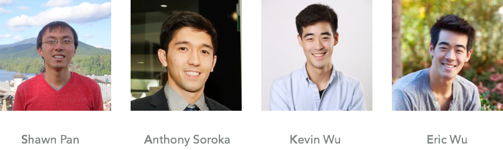

# Conclusion

In summary, we made critical enhancements to the open-source annotation platform OHIF, including adding automated 3D segmentation and a machine learning pipeline.  The new features will expedite the generation of a dataset that will enable object detection algorithms to significantly improve the medical diagnostic procedure both in time and accuracy.  We look forward to radiologists using the new framework in the near future.

Moreover, this project illustrates the potential computational science has in applications to the medical sciences.  Saké Viewer can potentially pave the way for revolutionizing the annotation and diagnosis process.  Beyond this, the fact that we found a relatively underutilized dataset, in a relatively short timeframe thoroughly cleaned the data, and generated analysis comparable to that produced in recent medical journals, illustrates the significant contributions computational scientists can have in medicine.

Finally, we offer our warmest gratitude to ourincredible partners (MGH CCDS), TF (Daniele Foresti), and instructors (Pavlos Protopapas and Eleni Kaxiras) who all made extremely meaningful contributions to this project.

{:class="img-responsive"}

**Contact:** *atsoroka@g.harvard.edu*

[Home](http://sakeviewer.com/)