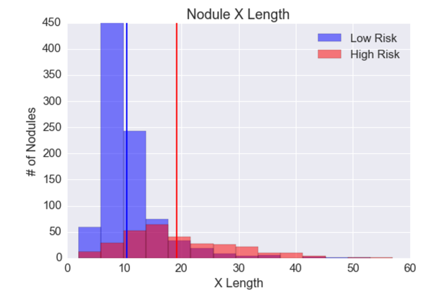
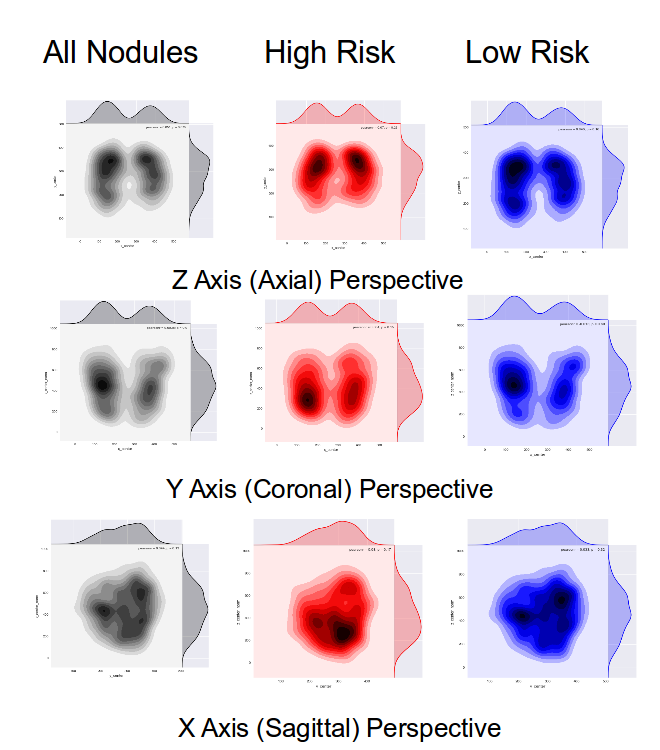

# Data

The last feature to be added is the machine learning pipeline.  However Saké is the framework that will enable the generation of the data that can be fed into the ML algorithms.  This forces us to look for data of comparable quality.  The National Cancer Institute (NCI) offers DICOM representations of lung cancer screening CT scans and XML-stored pixelwise annotations.  After significant cleaning of the 124GBs of data, the dataset contains 725 patients, 1,201 nodules, and 7,274 region of interest (ROI).

We next visualize the data and find that 1) larger nodules tend to be more likely malignant and 2) positional trends in nodule formation.  Such visualizations and analysis are comparable to recent medical science journal articles: i) *Distribution of Solid Solitary Pulmonary Nodules within the Lungs on Computed Tomography* (2016) ii) *Probability of Cancer in Pulmonary Nodules Detected on First Screening CT* (2013).

**Larger Nodules Tend to be More Likely Malignant**
{:class="img-responsive"}

**Positional Trends in Nodule Formation**

[Next](http://sakeviewer.com/ml.html)
