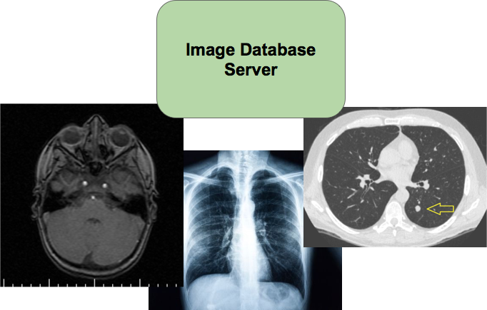
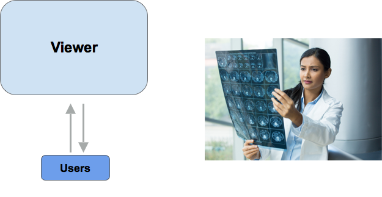
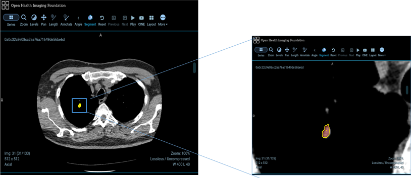
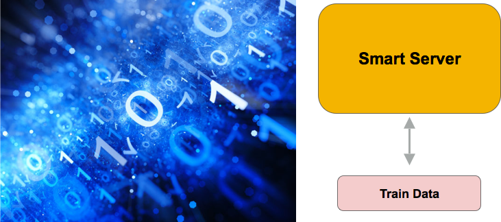
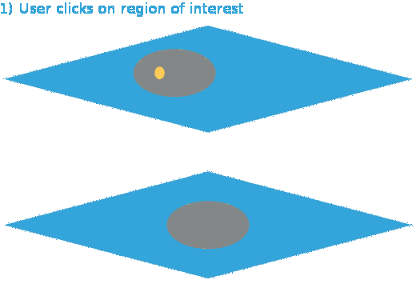

Let's have closer look at the specifications and implementation of the three main components of Saké.

# Image Database Server

### Specifications

- Ability to store and retrieve a variety of medical images (X-rays, MRIs, CT scans, etc.) and corresponding metadata
- DICOM (Digital Imaging and Communications in Medicine): The international standard for medical images and related information, allows for image type flexibility
-  Images accessible to various users across the globe

{:class="img-responsive"}{: .center-image }

### Implementation

- Images stored on Google Cloud, metadata (ordering of stack, patient info, etc) pre-generated through Python script
- Focus on Lung CT scans due to 1) partner interest 2) problem severity (200k+ new cases in US each year) 3) problem complexity (compared to other medical diagnosis problems, this appears more tractable) 

# Viewer

### Specifications

- Accessible to radiologists across the globe
- Standardized, easy-to-use annotation framework 
- Automated segmentation and propagation to adjacent slices. 
- Precise fine-tuning of the segments.

{:class="img-responsive"}{: .center-image }

### Implementation

- Originally, we presume we need to implement the entire front-end from scratch, until we realize there is considerable amount of software readily available
- Investigate Platforms: Stanford’s EPAD, Osirix, Dana Farber’s Imaging Platform
- Decide on: OHIF Viewer (Open Health Imaging Foundation) - the standard for open-source medical imaging
- Javascript and HTML5 canvas API
- Communicates with REST backend on the ML server via AJAX requests

{:class="img-responsive"}{: .center-image }

# Smart Server

### Specifications

- Backend of segmentation process for the viewer
- Machine Learning pipeline that can be easily upgraded
- ML assists doctors in detecting ROIs

{:class="img-responsive"}{: .center-image }

### Implementation: Segmentation

- Recursive flood-fill algorithm that takes in a seed point and expands the boundaries of an annotation until reaching a given threshold
- 2D ROI is propagated to adjacent 2D images on the Z-axis. 
- **Inspiration:** William Gray Roncal, *VESICLE: Volumetric Evaluation of Synaptic Interfaces using Computer vision at Large Scale*

{:class="img-responsive"}

