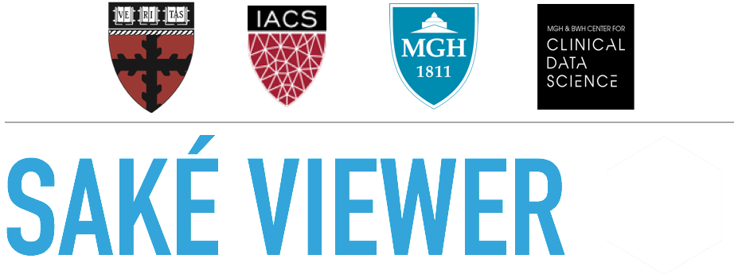

# Abstract

Cancer is considered one of the major challenges of humanity in the 21st century. A pillar for fighting cancer is its correct diagnosis mostly based on medical imaging. Despite great progress in machineries and image resolution, typical data processing is still performed manually by a radiologist, similar to using a marker on X-ray film. Moreover, 10% of diagnoses are estimated to be erroneous even today.  Machine learning has the potential to drastically improve the accuracy, efficiency and effectiveness of disease detection, and as a result can save millions of lives. Unfortunately, despite a plethora of data available, only a small percentage of such is labeled well enough to be used for machine learning. This shortage is the bottleneck to unleashing machine learning to revolutionize medical diagnosis. Here, we present Saké, an annotation framework that significantly improves this labeling process. Offering a combination of precise 3D segmentation, user-friendly interface, and cutting-edge computer vision algorithms, Saké enables radiologists to quickly create standardized annotations for regions of interest in a seamless and accurate manner.

[Next](http://sakeviewer.com/intro.html)