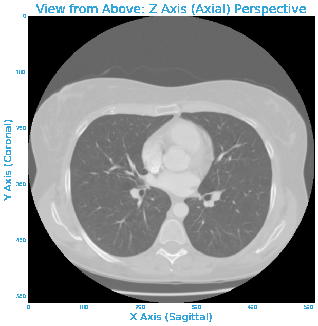
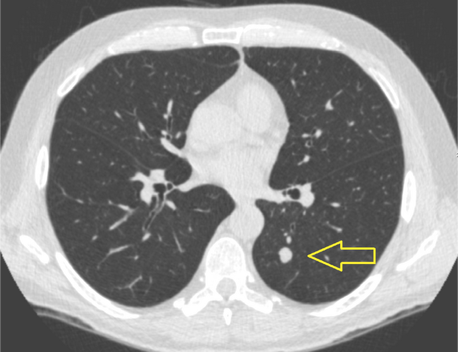

# Abstract

Cancer is considered one of the major challenges of humanity in the 21st century. A pillar for fighting cancer is its correct diagnosis mostly based on medical imaging. Despite great progress in machineries and image resolution, typical data processing is still performed manually by a radiologist, similar to using a marker on X-ray film. Moreover, 10% of diagnoses are estimated to be erroneous even today.  Machine learning has the potential to drastically improve the accuracy, efficiency and effectiveness of disease detection, and as a result can save millions of lives. Unfortunately, despite a plethora of data available, only a small percentage of such is labeled well enough to be used for machine learning. This shortage is the bottleneck to unleashing machine learning to revolutionize medical diagnosis. Here, we present SAKÉ, an annotation framework that significantly improves this labeling process. Offering a combination of precise 3D segmentation, user-friendly interface, and cutting-edge computer vision algorithms, SAKÉ enables radiologists to quickly create standardized annotations for regions of interest in a seamless and accurate manner.

## Introduction

Prior to being able to contribute to tackling a challenge as difficult as cancer, we first need to understand how experts are currently approaching such problems.  Medical diagnosis is currently heavily reliant on medical imaging.  Below is an example of medical imaging, a computed tomography (CT) scan of a persons lung.  The below is illustrative of a radiologist scrolling through consecutive adjacent 2D cross-sectional slices of a persons lung to effectively get a 3D representation of the patients lung.

{:class="img-responsive"}

Let's put ourselves in the shoes of a radiologist.  The doctor would likely being looking to spot a pulmonary nodule - or a growth within the lung that could potentially be malignant (i.e. cancerous).  Can you spot it?

{:class="img-responsive"}

Below we see the nodule is in the bottom left corner encircled in red. 

{:class="img-responsive"}

Clearly, a human would require considerable training to be able to distinguish between a nodule versus a blood vessel (the other small white objects). However, Computational Science should be able to improve this process. Specifically, by using applying fields such as Machine Learning and Data Science, we should be able to save time, resources, and lives.  In particular, using machine learning would be aggregating the knowledge of thousands of doctors with their years of experience and applying such for each and every diagnosis.  This should drastically improve accuracy and inevitably save lives.

The vision of applying Computational Science to improve medical diagnosis is shared with Massachusetts General Hospital (MGH).  MGH is one of the worlds preeminent hospitals, consistently leading medical innovation.  In spring 2016, MGH invested millions of dollars to found the Center for Clinical Data Science bringing together software engineers, doctors, machine learning PhDs, and Data Scientists to turn this vision into a realization.

Machine learning approaches such as Convolutional Neural Networks has led to significant object identification improvements in recent years.  However, these approaches require large amounts of high quality data.  While radiology over the years has generated billions of medical images, the annotations have often been weakly annotated.  Weakly annotated means either a per image annotation (i.e. in this image there is a problem) or as per below where a general region is annotated, but there is no specific pixelwise recording of the problem.

{:class="img-responsive"}

Hence our team seeks to contribute to the field of medical diagnosis by building a standardized annotation framework that will help turn the mass amount of weak data into strong data.

#PLACEHOLDER: GIF of WEAK DATA -> STRONG DATA

## Goal

With a firm understanding of the current state of medical  form Saké - a precise, fast, and standardized web-based medical imaging annotation framework.  Our ambitious mission is to revolutionize medical diagnosis through machine learning by generating high-quality medical data.

To make this dream a reality, we work with MGH to determine the below specifications of this framework:

- Ability to store, retrieve, and view a range of medical images and corresponding metadata
- Accessible for radiologists across the globe
- Standardized, easy-to-use annotation framework
- Machine Learning pipeline that can be easily upgraded.  Assists doctors in detecting regions of interests (ROIs).

With these specifications, we develop the below schematic as a guide for how to progress:

#PLACEHOLDER: 3 Components schematic

Crucial in our design is that each of the three major components communicate through well-defined interfaces and can be independently exchanged.  This will allow for the framework to be constantly improved.

## Implementation

Let's closer look at each of the three main components of Saké

### Image Database Server

#### Specifications

- Ability to store and retrieve a variety of medical images (X-rays, MRIs, CT scans, etc.) and corresponding metadata
- DICOM (Digital Imaging and Communications in Medicine): The international standard for medical images and related information.
-  Images accessible to various users across the globe

#PLACEHOLDER: Image Database with XRAY, MRI,CT - need to create a new image

#### Implementation

- Images stored on Google Cloud, metadata  (ordering of stack, patient info, etc) pre-generated in Python
- Focus on Lung CT scans due to 1) partner interest 2) problem severity (200k+ new cases in US each year) 3) problem complexity (compared to other medical diagnosis problems, this appears more tractable) 

### Viewer

#### Specifications

- Accessible for radiologists across the globe
- Standardized, easy-to-use annotation framework 
- Automated segmentation and propagation to adjacent slices. 
- Precise fine-tuning of the segments.

#### Implementation

- Investigated Platforms: Stanford’s EPAD, Osirix, Dana Farber’s Imaging Platform
- Decided on: OHIF Viewer (Open Health Imaging Foundation)

## Data / Machine Learning

## Demo

To see SAKE in action, check out [demo stack 1](http://104.198.43.42/stack1.json) or [demo stack 2](http://104.198.43.42/stack2.json).

### Tips for navigating the OHIF viewer
- Scroll wheel or up/down arrows to view different slices.
- Right click and drag to zoom in and out.
- Middle click and drag to pan.

### Creating a segmentation with SAKE
1. Click the **Segment** button to activate the tool.
1. Click on region of interest. The plugin will fill out the bounding polygon.
1. Drag the center sqaure up and down to adjust the threshold of the algorithm.
1. Drag individual vertices to fine tune the polygon.
1. Scroll through the slices to propagate segmentation in 3D.

### SAKE tips
- The maximum area of a segment has been capped. The tool rejects attempts to click on a large region or to increase the threshold too much.
- Thresholds are propagated only to unseen slices. Adjust the threshold before scrolling to nearby slices to propagate the threshold.
- The **Save** button will send all the polygon segments back to the server.
- Dragging a vertex off the slice will delete the whole 3D segment.

## Conclusion



Overview​: Provide an overview of the project. It is important that you include a
general context for and an overall description of as well as any introductory information
that’s specific to the project.
● Motivation​: Introduce the project motivation both as a whole as well as motivations
for important defining aspects of your work. Were there any visualization or UI
primitives that informed your work.
● Description of Data​: What data are you dealing with? What methods have you used
to explore the data (incl. initial explorations, models, data cleansing and reconciliation,
etc)? What insights did you gain? How did those methods influence your work?
● Literature Review/Related Work​: This can include noting any key papers, texts,
other software sources, talks or websites that you have used to develop your modeling
approach and/or that informed your demo/site
● Modeling Approach: ​ What was your baseline model for comparison? What further
models did you implement?
● Results:​ Describe the results and emphasize the most important results. Did you have
to reconsider some of the original assumptions?
● Conclusions and Summary
● Future work
● Style​: Your work should embrace simplicity over complexity, be intuitive for an only
slightly informed user to navigate, and as much as possible be appropriately polished,
robust, and reliable. Visualizations should constructed to slice through complexity and
convey as information and insight elegantly and concisely. We recognize that these are
not going to be fully constructed products but style matters​.
● Software Deployment​: In some situations the demo or website will sit on top of a
multi-layered software stack including software service, API, and client layers. Your
team should deploy your software stack with the goal of making the final report as
self-contained as possible for the duration of the evaluation period. For teams with
sensitive data please



## Welcome to GitHub Pages

You can use the [editor on GitHub](https://github.com/capstone-mgh/capstone-mgh.github.io/edit/master/index.md) to maintain and preview the content for your website in Markdown files.

Whenever you commit to this repository, GitHub Pages will run [Jekyll](https://jekyllrb.com/) to rebuild the pages in your site, from the content in your Markdown files.

### Markdown

Markdown is a lightweight and easy-to-use syntax for styling your writing. It includes conventions for

```markdown
Syntax highlighted code block

# Header 1
## Header 2
### Header 3

- Bulleted
- List

1. Numbered
2. List

**Bold** and _Italic_ and `Code` text

[Link](url) and 
```

For more details see [GitHub Flavored Markdown](https://guides.github.com/features/mastering-markdown/).

### Jekyll Themes

Your Pages site will use the layout and styles from the Jekyll theme you have selected in your [repository settings](https://github.com/capstone-mgh/capstone-mgh.github.io/settings). The name of this theme is saved in the Jekyll `_config.yml` configuration file.

### Support or Contact

Having trouble with Pages? Check out our [documentation](https://help.github.com/categories/github-pages-basics/) or [contact support](https://github.com/contact) and we’ll help you sort it out.
