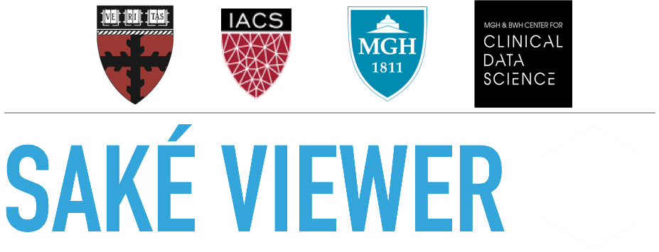
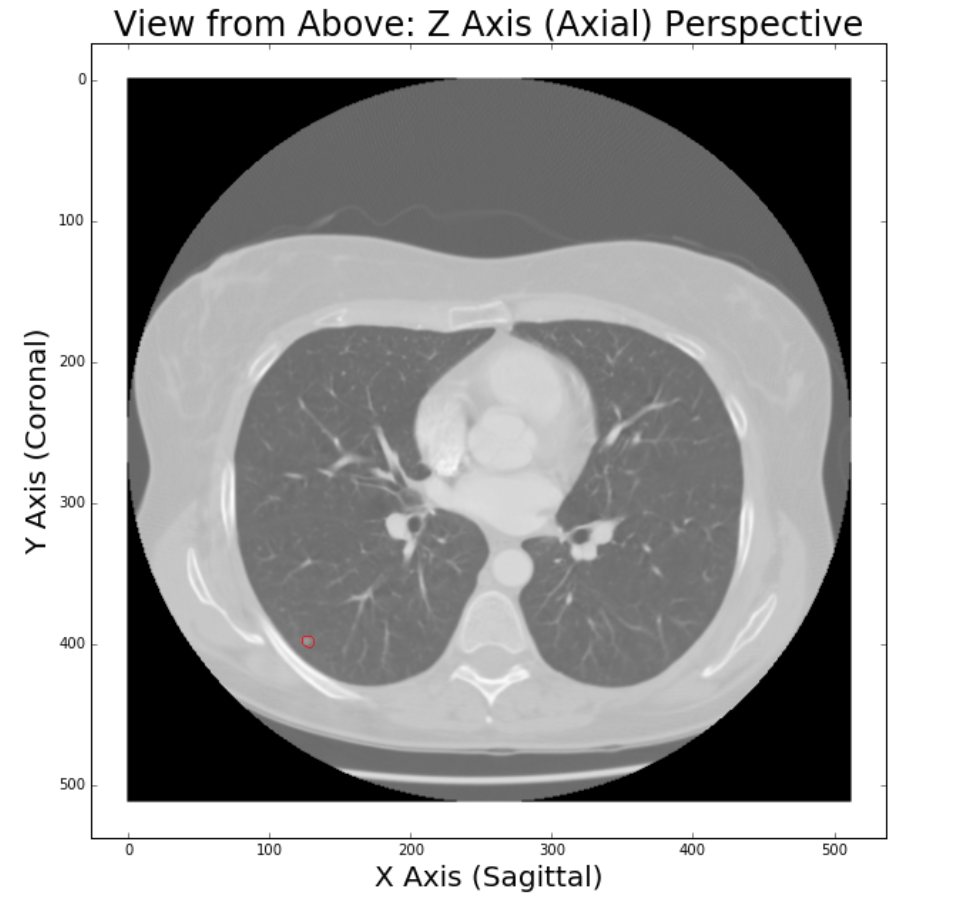
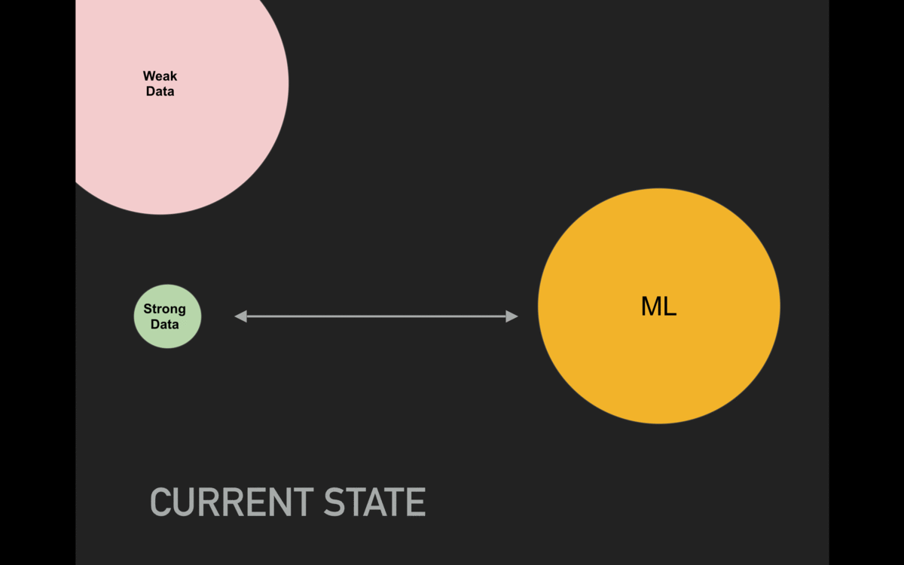

# Introduction

With aspirations of contributing to the fight against cancer, we first need to understand how doctors currently diagnose the disease.  At present, medical imaging plays a crucial role in diagnosis.  Below is an example of medical imaging; specifically we view a computed tomography (CT) scan of a persons lung.  The below is illustrative of a radiologist scrolling through consecutive adjacent 2D cross-sectional slices of a patient's lung to effectively obtain a 3D representation of the lung.

{:class="img-responsive"}{: .center-image }

Let's put ourselves in the shoes of a radiologist.  The doctor would likely being looking to spot a pulmonary nodule - or a growth within the lung that could potentially be malignant (i.e. cancerous).  Can you spot it?

{:class="img-responsive"}{: .center-image }

Below we see the nodule is in the bottom left corner encircled in red.

{:class="img-responsive"}{: .center-image }

Clearly, a human would require considerable amount training to learn to accurately distinguish between a nodule versus a blood vessel (the other small white objects in the image). However, Computational Science should be able to improve this process. Specifically, by using applying fields such as Machine Learning and Data Science, we should be able to save **time**, **resources**, and **lives**. Doctors could spend more time with their patients rather than in front of computers and medical costs would be reduced.  Most importantly, Machine Learning would aggregate the knowledge of thousands of doctors with their years of experience and apply such information to each diagnosis.  This would drastically improve accuracy and inevitably save lives.

Massachusetts General Hospital (MGH) similarly envisions applying Computational Science to improve medical diagnosis.  MGH is one of the worlds preeminent hospitals, consistently leading medical innovation.  In the Spring of 2016, MGH invested tens of millions of dollars to found the Center for Clinical Data Science bringing together software engineers, doctors, machine learning PhDs, and Data Scientists to turn this vision into a reality.

Machine Learning approaches such as Convolutional Neural Networks has led to significant improvements in Object Identification in recent years.  However, these approaches require large amounts of high quality data.  While the field of radiology has generated billions of medical images, the annotations have often been weakly annotated.  Weakly annotated implies there is little-to-no pixelwise recording of the problem.  Instead, in weak data, the annotation may be either per image (effectively stating: *"in this image, there exists a problem"*) or merely reference a vague general location (as per the below image).

{:class="img-responsive"}{: .center-image }

Hence our team seeks to contribute to the field of medical diagnosis by building a standardized annotation framework that will help turn the mass amount of weak data into strong data.

{:class="img-responsive"}{: .center-image }