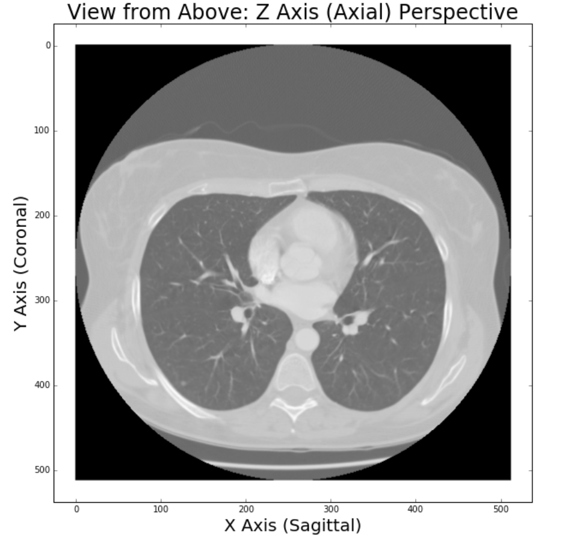

# Introduction

Prior to being able to contribute to tackling a challenge as difficult as cancer, we first need to understand how experts are currently approaching such problems.  Medical diagnosis is currently heavily reliant on medical imaging.  Below is an example of medical imaging, a computed tomography (CT) scan of a persons lung.  The below is illustrative of a radiologist scrolling through consecutive adjacent 2D cross-sectional slices of a persons lung to effectively get a 3D representation of the patients lung.

{:class="img-responsive"}

Let's put ourselves in the shoes of a radiologist.  The doctor would likely being looking to spot a pulmonary nodule - or a growth within the lung that could potentially be malignant (i.e. cancerous).  Can you spot it?

{:class="img-responsive"}

Below we see the nodule is in the bottom left corner encircled in red.

{:class="img-responsive"}

Clearly, a human would require considerable training to be able to distinguish between a nodule versus a blood vessel (the other small white objects). However, Computational Science should be able to improve this process. Specifically, by using applying fields such as Machine Learning and Data Science, we should be able to save time, resources, and lives.  In particular, using machine learning would be aggregating the knowledge of thousands of doctors with their years of experience and applying such for each and every diagnosis.  This should drastically improve accuracy and inevitably save lives.

The vision of applying Computational Science to improve medical diagnosis is shared with Massachusetts General Hospital (MGH).  MGH is one of the worlds preeminent hospitals, consistently leading medical innovation.  In spring 2016, MGH invested millions of dollars to found the Center for Clinical Data Science bringing together software engineers, doctors, machine learning PhDs, and Data Scientists to turn this vision into a realization.

Machine learning approaches such as Convolutional Neural Networks has led to significant object identification improvements in recent years.  However, these approaches require large amounts of high quality data.  While radiology over the years has generated billions of medical images, the annotations have often been weakly annotated.  Weakly annotated means either a per image annotation (i.e. in this image there is a problem) or as per below where a general region is annotated, but there is no specific pixelwise recording of the problem.

{:class="img-responsive"}

Hence our team seeks to contribute to the field of medical diagnosis by building a standardized annotation framework that will help turn the mass amount of weak data into strong data.

#PLACEHOLDER: GIF of WEAK DATA -> STRONG DATA