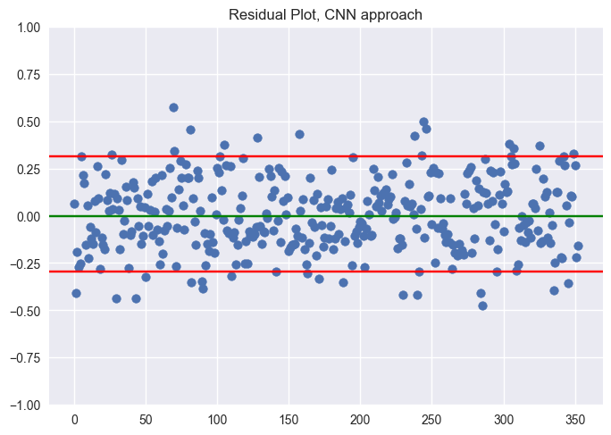
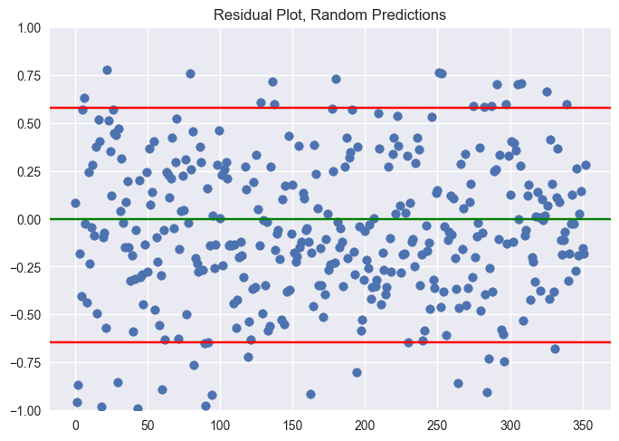

# Machine Learning

Our ML contribution consists of two parts:

- An ML pipeline implemented in Keras and Theano that allows for live ML predictions of nodule segmentations.
- A convolutional neural network model (informally called ShapeNet) that generates malignancy scores based on the user-inputed segmentation shape. 

## ML Pipeline

## ShapeNet: a shape-based ConvNet for Malignancy Prediction

### Generated Masks

### Convolutional Network Architecture

### Loss across Epochs

### Residual Plot of ShapeNet

### Residual Plot of Random Noise

[Next](http://sakeviewer.com/demo.html)
