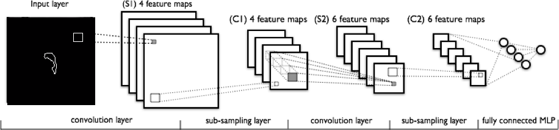

# Machine Learning

### Implementation: Machine Learning

Given this is but a semester project and our top priority is the segmentation/annotation framework, we have a limited amount of time to produce a machine learning pipeline.  We decide on two relatively simplistic yet respectable machine learning approaches: 

- Compute percentiles that the area and location of each ROI falls within using multivariate kernel density estimation. 
- Predict the probability that a nodule is malignant based off its shape. Approach involves 3-D convolutional neural network that detects the contours of each annotation.
- **Inspiration:** Olaf Ronneberger, Philipp Fischer, Thomas Brox, *U-Net: Convolutional Networks for Biomedical Image Segmentation*

{:class="img-responsive"}

[Next](http://sakeviewer.com/demo.html)
