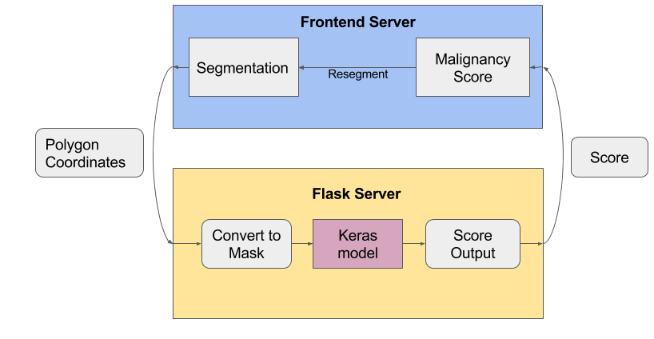
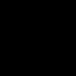
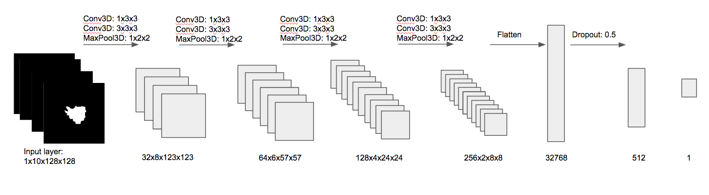
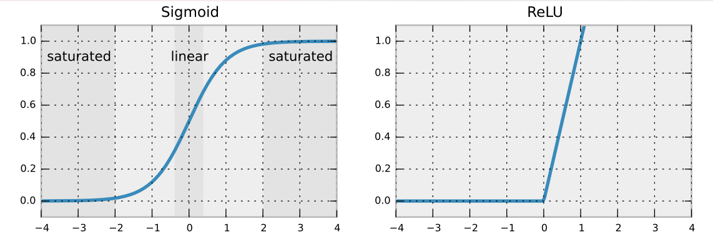
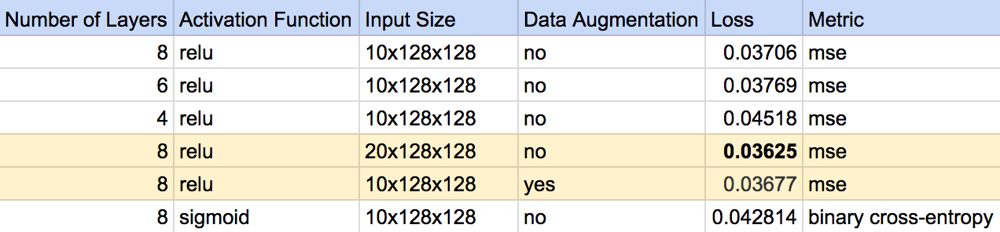
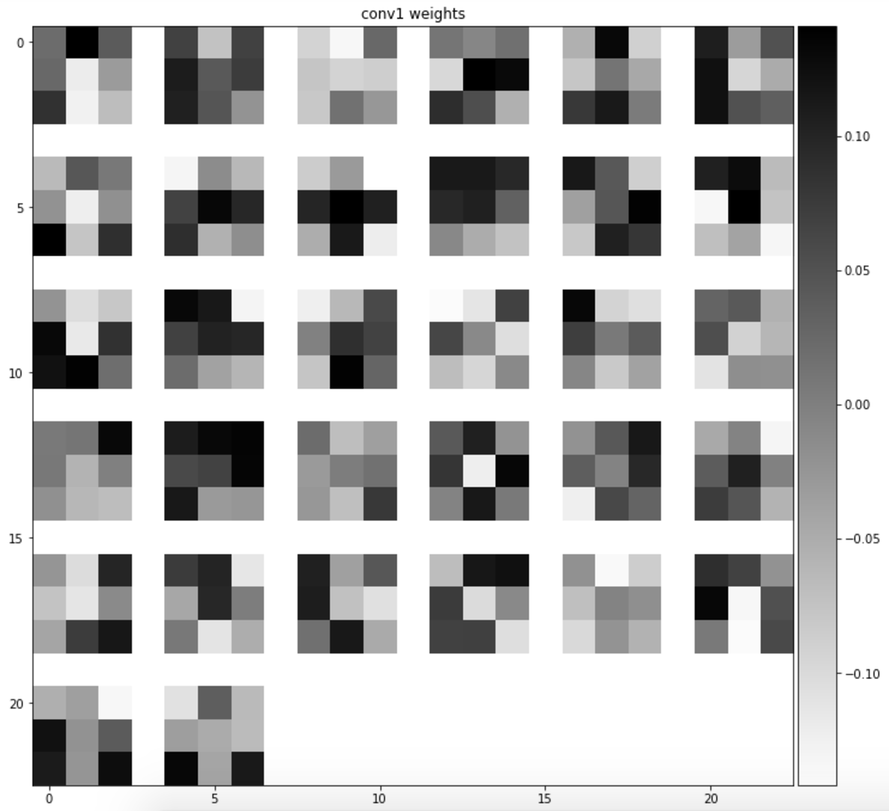
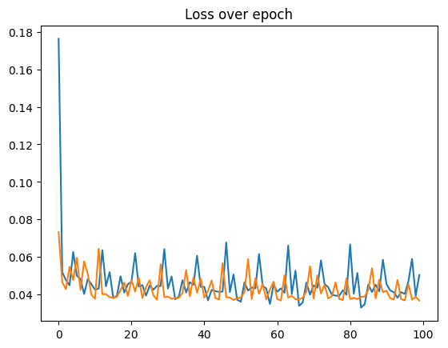
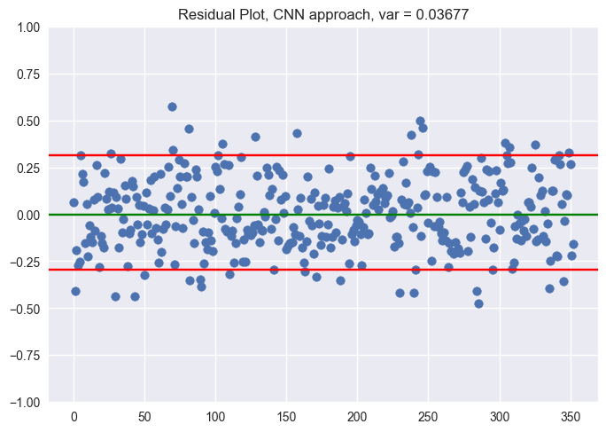
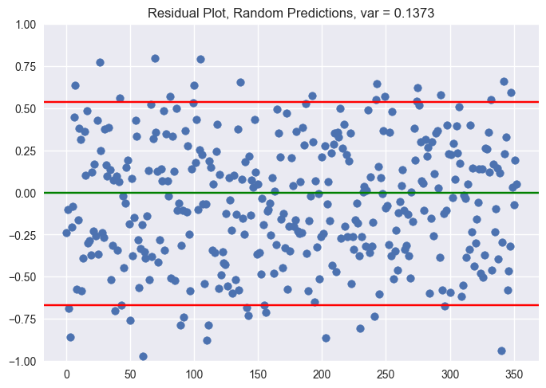

# Machine Learning

### Introduction

Does the shape of a nodule annotation itself reveal something about malignancy? 

SAKE is an annotation framework aimed at making labeling nodules easier for radiologists. At the very heart of this software is the belief that accurate and standardized annotations are very important for precise algorithms. We aim to provide analytics behind this claim by investigating how annotation shapes affect predicted malignancy.

In our analysis, we use convolutional neural networks to detect features about shape and structure in nodules annotations.

### Assumptions

We are isolating the effect of annotation shape alone. There are clearly other factors at play when determining malignancy which we do not account for in this network:

- Pixelwise intensity in DICOM. A key part of diagnosis is the intensity and thresholds at which certain feature appear within a proposal region.
- Location within lung. We center the annotation region in a box, which in effect removes any localization information in our input data.
- Covariance between neighboring structures. We also do not include information on how many other vesicles or nodules that are nearby, which can be an indication of malignancy as well.
- Out of image context. This refers to any other context a radiologist might use, such as a patient’s previous medical history (eg. smoking, genetics, etc.)

### Data

We use data from the [National Cancer Institute (NCI)](https://wiki.cancerimagingarchive.net/display/Public/LIDC-IDRI) that includes a 1-5 malignancy rating on X DICOM images. 

## Overview

Our ML contribution consists of two parts:

### ML Pipeline

- An ML pipeline implemented in Keras and Theano that allows for live ML predictions of nodule segmentations.

### ShapeNet: a shape-based ConvNet for Malignancy Prediction

- A convolutional neural network model (informally called ShapeNet) that generates malignancy scores based on the user-inputed segmentation shape. 

#### How should we model malignancy?
- Approach 1: A 5-class classification problem. Since we have 5 classes as our target variable, we can possibly just do a classification of each of the respective five classes. However, the clear issue arises that a neural network does not treat each class as ranked — they would be distinct classes. We do not expect the difference between a 4 rating and 5 rating to be the same as the difference between a 1 ranting and a 5 rating, so the scheme would be a weak approach. In other words, this is not a problem akin to discrimination between a cat and dog.
- Approach 2: A binary classification problem: We can alternatively just create two classes. Given five classes, we can split the data into [1,2] ratings and [3,4,5] ratings, or [1,2,3] and [4,5] ratings, assigning each a ‘low’ or ‘high’ risk. We were close to implementing our model this way, especially since binary classification methods have easier evaluation regimes. However, we decided against it for two reasons. First, it was not clear that creating a cutoff between low and high risk would be in any way natural — to say that something of a 2 rating was in a different class to something in a 3 rating would still create some of the issues we described above. Second, we wanted to take advantage of the fact that we are in fact given 5 classes and incorporate the relative risk in a meaningful way in the model.
- Approach 3: A regression problem. This seemed to be the most reasonable approach, with some caveats. First, our data is not continuous, so our predictions would yield some extra loss unless they fell directly on one of the five integers. To remedy this, we normalized our data from 0 to 1, so our new targets were [0.2, 0.4, 0.6, 0.8, 1]. Next, since all our labeled data assumed at least some risk of malignancy, we did not have a ‘0’ class (or a class indicating “no malignancy”). This means even when clicking on a random vesicle that does not have some malignancy, our model tends to still give a non-zero value. Therefore, this means our model does not directly model “risk of malignancy” per se, but rather probability of malignancy given a suspected region).

#### Input Generated Masks

The input volume is a 10x128x128 binary mask of the segmentation polygon. Below are 6 samples animated in the z-direction.

#### How do we build the architecture?

We build our CNN with the following architecture:

We perform two convolutions in a row before shrinking the image by half for a total of 8 layers. In our flattened layers, we add a dropout of 50% to allow for generalization. Finally, we use ReLU activation on our final layer to accommodate the fact that we are performing a regression.

While parameter selection and tuning can turn into an infinitely time consuming and complex task, we selected several key meta-paramters to focus on.

- Layers: Results from AlexNet, VGG-16, and VGG-19 show that depth of a network has a predominant influence on performance.

- Data Augmentation: Previous research has also proven that increasing training data by slightly altering input images improves the network’s ability to generalize.

- Last-Layer activation function: The last layer’s activation function is responsible for how we ‘collapse’ the flattened layer before it, which affects how the output of the network is fed into our loss function.

- Input size: Finally, the size of our input can influence both the memory footprint of our network as well as the amount of data we can feed into the model.

The results of parameter tuning are displayed below:

Key takeaways:
- First, more layers does improve performance. We do not expect 16 or 19 layers to be necessary given the simplicity of our training data, so we start with 4 layers and add two more each time. We see that there is only a marginal improvement when we go from 6 layers to 8 layers. Our algorithm performs reasonably fast (<1 second/ prediction on GPU), so we can afford 8 layers. However, if speed does become an issue, we note that we can also get similar performance with a 6 layer network.
- Second, data augmentation sightly improves performance. However, the difference in loss is slight, meaning that data gained from flipping the images only provides a little more information to the network.
- Third, we confirm our intuition that the last layer activation choice of ReLU is more appropriate than sigmoid. We prefer a linear activation since we care about producing predictions relatively smoothly from 0 to 1. Meanwhile, a sigmoid activation forces values to either 0 or 1, increasing our error.

- Finally, we do see that increasing the number of z-axis slices reduces loss. However, this network takes roughly 1.7 times longer to train, which also has implications for prediction time. Therefore, we prefer a smaller network since over 95% of our data can be contained within 10x128x128 box.

#### How do we evaluate this model?

We decide to measure loss using mean squared error since this is a regression problem. However, since we are using ReLU, the maximum prediction can be unbounded past 1, so we introduce a slightly modified MSE that clips values greater than 1 to be just 1.

#### Loss by Models

#### First-layer Kernels

#### Loss across Epochs

Finally, to evaluate results, we compare both MSE and residual plots.

#### Residual Plot of ShapeNet and Random Noise

We would also like to have an R^2-like metric to evaluate our performance. Since an explicit formulation is not available, a close proxy is a comparison of residual variance between a random-prediction model and our CNN. 

### Results

We aim to investigate how much affect the shape of an annotation has on the probability of malignancy of a proposed region. Using a CNN optimized for performance and speed, we modeled malignancy based off extracted features of the contours and edges in 3D annotations. Our model produces a mean squared error of 0.036774, which is 3.79 times better than random predictions. In addition, the variance of residuals for our model is 0.036771, which is 3.73 times better than random predictions.
Another way to interpret these results is to look at the mean absolute error of 0.15809, which indicates that on average, the difference between the predicted malignancy probability is about 16% compared to the actual malignancy.

### Discussion and Future Work

Our results suggest that seeing shape alone can play a significant role in determining the malignancy of a nodule. 
We believe this information can be very useful in helping radiologists validate the semi-automated segmentations produced by SAKE. Our hope is that ShapeNet and the SAKE ML pipeline can serve as a benchmark for future work in assisting high-quality annotations. In particular, we believe that incorporating image-wise binary classification can be a useful "double-check" mechanism for radiologists. 

[Next](http://sakeviewer.com/demo.html)
